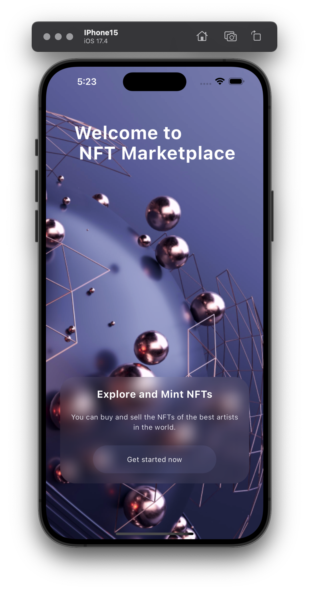
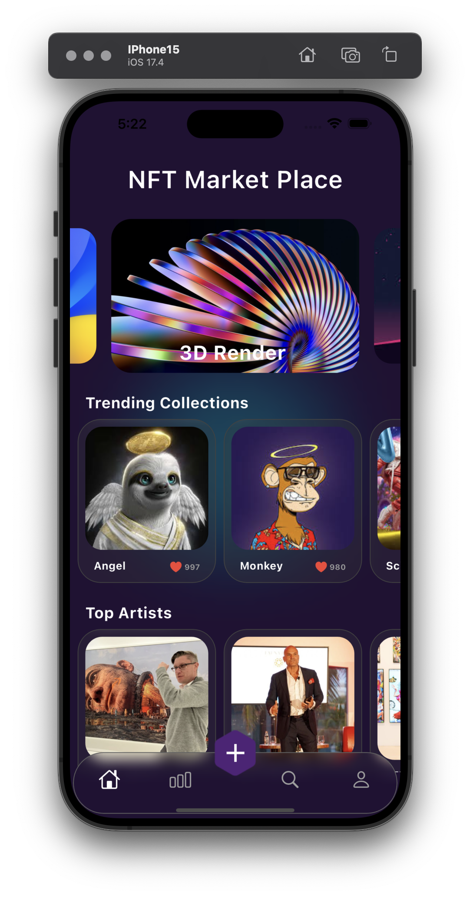
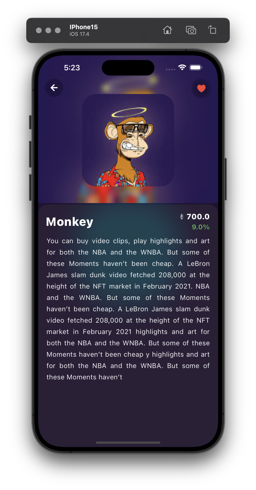
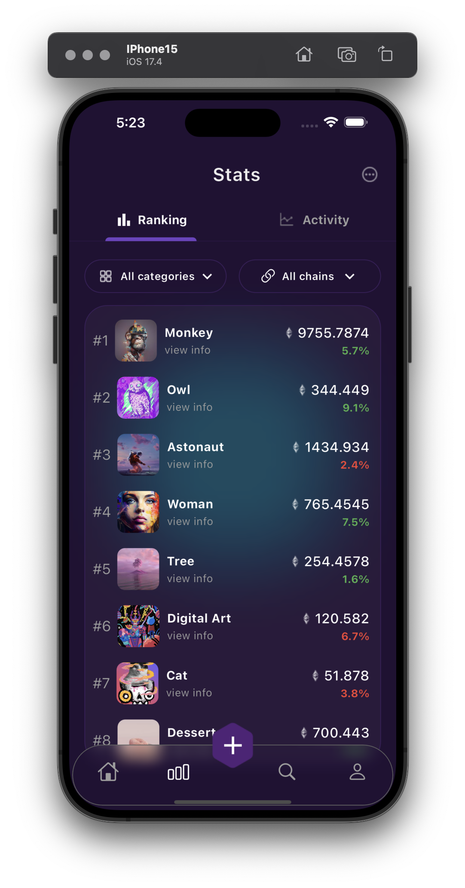

A  Flutter NFT Market Project.

Note WebApp(PWA) is also avaleble!

The #flutter_nft_market project has been achieved without using any third-party animation packages and all are made by myself😎 
In this Project, I have used #flutter_bloc and #equatable as state-maneger.
For changing app Icon I have use #flutter_launcher_icons.

Open to any countrbution✨

Feel free to forkfork😉

Dont forget to star⭐️

## Images:  

 
 
 
 
